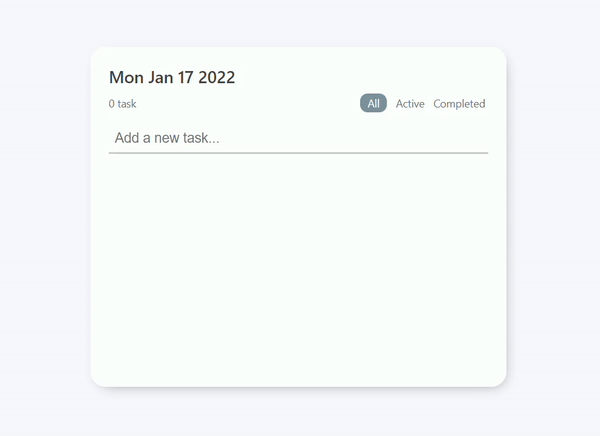

# todolist-js

## Stack
* HTML
* CSS
* JavaScript

## Period
2022.01.15 ~ 2022.01.16

## 기능
* 오늘의 날짜 확인 가능
* todo 개수 표시
* 전체, 진행 중, 완료된 todo를 선택하여 볼 수 있음
* todo는 localStorage에 저장되어 새로고침하여도 삭제되지 않음
* 반응형으로 모바일에서는 전체 화면으로 전환됨
